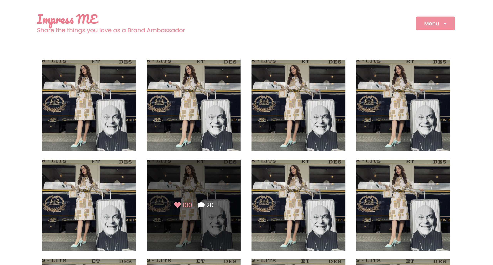
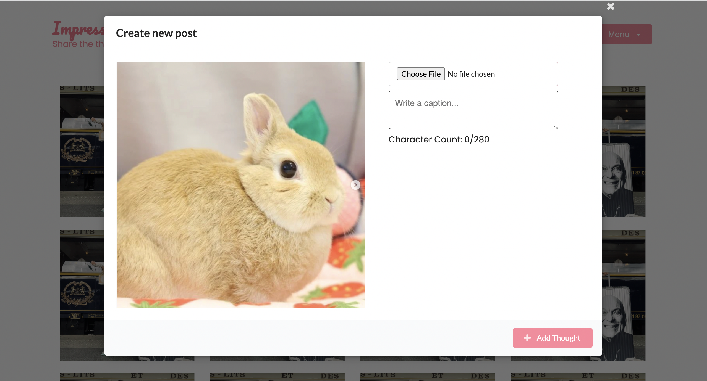

## Impress ME


## Description

Impress ME is an influencer platform which focuses on the sharing of products by various organizations or individuals from all categories and domains of works.
In this app users can share an existing product or a new product and have followers comment and follow their post.

### Design Ceonept

Provide more opportunities for those potential influencers who can become more powerful and help brands reach win-win situation!

### Why Impress ME?

- I want to become an influencer
- I want to introduce the product I love
- I want to meet the right brands

### Our Plan is…

- Build an influencer platform for those start up brands who do not want to spend too much on influencer marketing.
- Help the influencer find the right brands

### User Story

```
AS a new user I WANT to be able to sign up when I go to the homepage SO THAT I can see the homepage
As a new user I WANT to see recommendations on homepage SO THAT I can see someone posts
AS a user I WANT to be able to login when I go to homepage SO THAT I can see the posts
AS a user I WANT to see the posts on the homepage after login SO THAT I can favorite it
AS a user I WANT to add the post SO THAT I can see my post including an image and caption
```

### Acceptance Criteria

```
GIVEN a login setup page presented a "xx" logo, login form, and a sign-up button 
WHEN I click the sign up button 
THEN it pops up a sign-up form with the name, email, and password 
WHEN I complete the form and submit it 
THEN it shows me the homepage with recommendation posts

GIVEN a homepage presented posts, user’s name, and logout button
WHEN I click the logout button
THEN I log out 

GIVEN I have an account
WHEN I complete the login form and click the login button
THEN it shows me the homepage with posts 

GIVEN a favorite button with the number of favorite on each post
WHEN I click the favorite button
THEN the favorite button change the color and the number of favorite increase 

GIVEN a new post button
WHEN I click the new post button
THEN it pops up a form, including inserting an image, and adding captions
WHEN I complete and submit it
THEN my post shows on the homepage
```

### Optional user stories

```
AS a user I WANT to edit the caption of my post SO THAT I can change the caption
AS a user I WANT to delete the post SO THAT I won’t see my post on homepage
AS a user I WANT to follow someone SO THAT I can see his/her posts
AS a user I WANT to unfollow someone SO THAT I won’t see his/her posts
AS a user I WANT to favorite the post SO THAT I can promote the post
AS a user I WANT to remove favorite from the post SO THAT I can change my mind
As a user I WANT to comment on a post SO THAT I can express my thoughts
As a user I WANT to update my comment SO THAT I can change my comment
As a user I WANT to delete my comment SO THAT I can delete my comment
As a user I WANT to search posts or people SO THAT I can follow them
```

## Table of Contents:

1. [Installation](#installation)
2. [Usage](#usage)
3. [Technologies](#technologies)
4. [License](#license)
5. [Contributing](#contributing)
6. [Tests](#tests)
7. [Questions](#questions)

## Installation

The following dependencies are needed and must be installed for this application to run effectively:

- semantic UI
- Apollo-server-
- bcrypt
- express
- graphql
- jsonwebtoken
- mongoose

## Usage

For users to post pictures of their prodcuts to the Impress ME website, they have to signup or login and upload a post. Users can also follow other users, like and comment on their post.

- Homepage shows the beautiful tiles and with dimmer effect on the images. Comment or Like it
  

- Comment, Follow or Reply
  

- Create New Post
  

## Technologies

1. React for the front end
2. Semantic UI
3. GraphQL with a node.js and Express.js server
4. MongoDB and Mongoose ODM for the database
5. Queries and mutations for retrieving, adding, updating and deleting data
6. JWT Authentication
7. AWS S3 Platform to store images

## License

[](https://opensource.org/licenses/MIT)

## Other files

- Please click [HERE](https://drive.google.com/file/d/1qqwsxnuhvGD3it5bchqAF0ODnv0usmEX/view?usp=sharing) for the proposal
- Please click [HERE](https://drive.google.com/file/d/1TESlpz1lQWrcRMv0rGWRs6VuzPCiKwbO/view?usp=sharing) for the presentation file
- Please click [HERE](https://impress-me-app1.herokuapp.com/) for the Impress ME app with Tiles version

## Task

Front End: Millie

- Login/ Logout/ Signup function ready/ Add post modal and choose the file in the computer/ Comment modal/ Hompage layout
- Semantic UI
- Publish to Heroku (twice, the first time was successful but that was the team version without showing my tiles, comment, like function)
- Prepared presentaiton file, user story and acceptance criteria

Back End: Kartiki & Honorine

- MongoDB Database/ Photo uploaded to AWS
- Follow/ Like/ Comment function

## Contributing

Contributions to this project are welcome.

## Questions

For all your questions, you can contact:
[Honorinenn](https://github.com/Honorinenn),
[MT0814](https://github.com/MT0814),
and [KS1](https://github.com/KS1).
